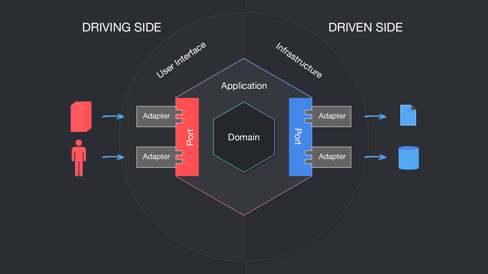
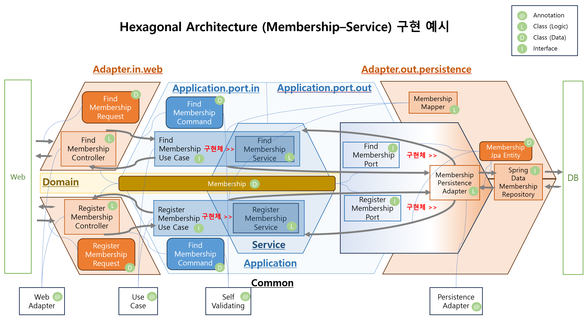

## #3 [p2] ch03. JPA와 Hexagonal 아키텍처를 활용한 고객 서비스 개발 2

 ### membership-service 의 회원 정보 저장, 찾기 API 요청을 Hexagonal Architecture 구조로 구현
(아래 내용과 관련하여 작성된 그림 자료는 document 폴더에 존재하며, 이를 포함한 markdown 파일도 동일 폴더에 있음. )

 MSA 을 구현하는 pattern 에는 다양한 방법이 있지만, MSA 의 기본적인 목적인 시스템의 유연성, 확장 및 테스트의 용이성 등의 장점을 살리기 위한 Hexagonal Architecture 을 적용한 가장 기본적인 business logic 을 포함한 회원 정보 저장, 찾기 기능을 구현.

1. 기본 개념 

[이미지 출처 링크](https://www.google.com/imgres?imgurl=https%3A%2F%2Fmiro.medium.com%2Fv2%2Fresize%3Afit%3A2000%2F1*mGLO5IfhJv4o0NYOAZI60A.png&tbnid=WFnEUG54nnhtCM&vet=12ahUKEwiyuOut58mCAxUmefUHHbqHD_wQMygCegQIARBJ..i&imgrefurl=https%3A%2F%2Fmedium.com%2Fssense-tech%2Fhexagonal-architecture-there-are-always-two-sides-to-every-story-bc0780ed7d9c&docid=REFD-m73XNg0lM&w=1920&h=1080&q=hexagonal%20architecture&ved=2ahUKEwiyuOut58mCAxUmefUHHbqHD_wQMygCegQIARBJ)
 
Domain 영역에 구현 하고자 하는 business logic 이 존재한다. Domain 영역은 외부 시스템에 의존적이지 않아야 한다. 그러나 Domain 구현은 외부 process (client) 의 요구 조건에 응답해야 하며, 이를 위해서는 또 다른 process(외부 service, DB) 와의 협력이 필요하다. 이렇게 외부와 정보를 주고 받을 때 일반적인 data 통신에서 사용하는 adapter-port 의 구조를 구현하여 service 를 구현하는 pattern 이 hexagonal architecture 이다. 

2. Spring 을 사용한 구현

해당 강의에서 Hexagonal Architecture 를 Spring 을 사용하여 구현한 구조는 다음과 같다. 

위 그림을 정보 전달 순서대로 서술해 보면,
1. web 으로 부터 요청 정보를 controller parameter 로 받는다. 이때, parameter type (web adapter) 용으로 미리 정의된 request class 를 사용한다. 
2. 전달 받은 request 는 service class 로 바로 전달하여 logic 간 의존성이 발생하지 않도록 변환하여 전달한다. 변환될 type 은 `Command` 로 사용자 정의된 component 가 적용된 command 객체이며, contoroller 에서는 command 객체로 service class 에 전달한다. 
3. 구현 service 객체는 미리 method signiture 를 정의한 'UseCase' interface 의 구현체 이다. interface 에서 input parameter 와 return type 을 미리 정의해 놓음으로써, 외부 조건은 명시적으로 표시하며, 추호 변경, 확장 작업이 필요할 경우, 해당 interface 에서의 정의를 수정하므로써, 해당 작업을 용이하게 만든다. 
4. Service 구현체는 필요한 작업을 DB 에 요청해야 한다. 여기에서 data in 의 상황과 동일하게 직접 repository 에 전달 하지 않고 port(DB 연결 조건을 정의한 interface) - adapter (port 의 구현체) 를 통한다. 이때 미리 interface 에 정의된 parameter type 은 domain(`Membership`) field 중 필요한 것을 찾아 전달한다.
5. 다양한 DB 작업이 필요한 service 들의 구현체인 persistence adapter 는 JpaRepository 를 통해 필요하 작업 (추가, 찾기) 작업을 요청한다. 
6. DB 작업의 결과를 그대로 `JpaEntity` type 으로 다시 Service 에 반환한다. 
7. Service 는 전달받은 `JpaEntity` 를 `Mapper` 를 사용하여 Domain 으로 변경하여, Controller 에게 반환한다. 
8. Controller 는 받은 Domain data 를 사용하여 최초 client 요청사항에 대한 적절한 Response 를 생성하여 반환한다.
 
 ### H2 in-memory DB 와 Swagger2 를 사용하여 실제 Url 요청이 작동됨을 확인

 - H2 접속 URL : http://localhost:8080/h2-console 
 - Swagger2 URL: http://localhost:8080/swagger-ui.html 

 application.yaml
 - H2 사용을 위한 설정 추가. 
 
 build.gradle
  - H2 사용 의존성 추가
  - Swagger2 의 경우, spring 3.0 이후 에서 의존성 library 변경 (implementation 'org.springdoc:springdoc-openapi-starter-webmvc-ui:2.0.2') (reference : https://colabear754.tistory.com/99)
